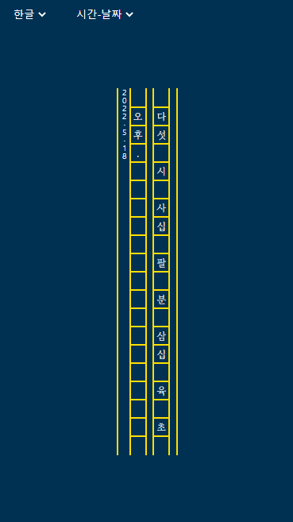

## Retro Clock

한글로 시간을 표시하는 한글 시계

### 로직

시간

* 일의 자리
  * 한, 두, 세, 네, 다섯, 여섯, 일곱, 여덟, 아홉

* 십의 자리
  * 열, 이, 삼, 사, 오

분, 초

* 일의 자리
  * 일, 이, 삼, 사 , 오, 육, 칠, 팔, 구
* 십의 자리
  * 십, 이, 삼, 사 , 오

### 디자인 참고

- '언어의 온도' 표지
- 윤동주 '별 헤는 밤'